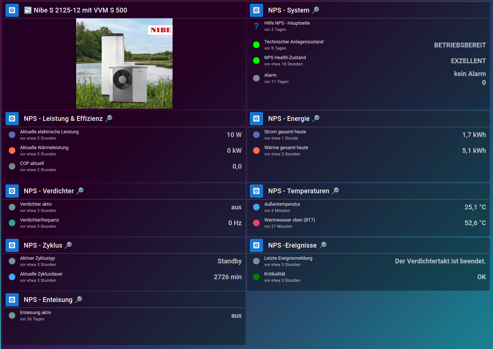

# NIBE Performance Suite (NPS)

NPS is an ioBroker-based monitoring, analysis and heating-optimization layer
for a NIBE heat-pump installation.

The project separates data acquisition, domain logic, presentation data and
Jarvis visualization.

## Features

NPS currently provides:

- heat-energy and electrical-energy monitoring
- allocation of energy to heating and domestic hot water
- COP and performance evaluation
- compressor monitoring
- temperature and flow-temperature monitoring
- cycle recording and cycle analysis
- defrost monitoring
- event generation and optional notification routing
- InfluxDB history management
- presentation data for Jarvis
- heating-curve analysis
- AI-assisted heating-optimization recommendations with NPS-side validation

The AI-assisted workflow is advisory only. NPS does not automatically apply
heating-curve optimization parameters to the NIBE system.

## Supported setup

NPS is currently developed and tested with:

- NIBE S2125
- NIBE VVM S500
- ioBroker
- NIBE communication through Modbus TCP
- ioBroker JavaScript adapter
- ioBroker InfluxDB adapter for history functions
- Jarvis 3.x for the reference visualization
- heatingcontrol for the optional HeatingCurveAnalyzer room evaluation

Other NIBE systems may be usable if the required Modbus registers and values
are available, but they have not yet been validated by the project.

Several modules currently use explicit ioBroker alias paths. A new installation
must therefore either reproduce the reference alias structure or adapt the
source definitions to its local ioBroker environment.

## Quick start

1. Configure the NIBE Modbus connection in ioBroker.
2. Create or adapt the required NIBE aliases.
3. Copy the scripts from `scripts/` into the ioBroker JavaScript adapter.
4. Commission the source-processing modules first.
5. Enable dependent analysis modules only after their input data is valid.
6. Configure InfluxDB history if required.
7. Configure optional NotificationBridge, Jarvis and HeatingCurveAnalyzer
   functions only after the NPS core is working.

For the complete installation and commissioning procedure, see:

**[Installation Guide](docs/INSTALLATION.md)**

## Architecture

```text
NIBE / Modbus
    ↓
Alias
    ↓
NPS domain modules
    ↓
DashboardData / documented public APIs
    ↓
Jarvis
```

The former central `00_NPS_Structure` module is no longer part of the V1
architecture.

Each domain module owns and creates its own public API below
`0_userdata.0.NPS`.

## Release status

NPS 1.0.0 is the frozen architectural baseline.

NPS 1.1 extends this baseline with heating optimization and the
HeatingCurveAnalyzer while preserving the established V1 architecture
and public APIs.

Current repository release:

**NPS 1.1.0-beta.2**

The core monitoring, energy, cycle and visualization functions are
production-tested.

Heating-period-dependent evaluations of the HeatingCurveAnalyzer have
passed structural, integration and smoke tests. The real seasonal
before/after optimization cycle remains subject to field validation
during suitable heating conditions.

Changes are classified as:

- **Bugfix 1.x** – corrections to existing behavior
- **Configuration change** – thresholds, colors, formatting, etc.
- **Minor release 1.x** – backward-compatible modules or analyses
- **Major release 2.x** – incompatible architecture or public API changes

## Repository layout

```text
.
├── scripts/                 # active ioBroker production modules
├── tools/                   # disabled maintenance / one-shot scripts
├── jarvis/                  # place for sanitized Jarvis exports / definitions
├── docs/                    # architecture, installation and reference documentation
├── .github/                 # GitHub templates
├── CHANGELOG.md
├── CONTRIBUTING.md
├── VERSION
└── README.md
```

## Module numbering

```text
01 VirtualMeters
02 EnergyAllocation
03 TemperatureMonitor
04 CompressorMonitor
05 DefrostMonitor
06 ProcessSignals
07 StateMachine
08 EventEngine
09 NotificationBridge
10 DashboardData
11 InfluxAdapter
12 ElectricalMeters
13 CycleAnalyzer
14 PerformanceAnalyzer
15 HeatingCurveAnalyzer
98 CycleRecorder
99 JarvisDeviceImporter
```

`00_NPS_Structure` is intentionally retired and its number is not reused.

`99_NPS_JarvisDeviceImporter` is a maintenance/import tool and is not part of
the continuously running production module set.

## Jarvis device API

The unified importer manages these reference devices:

```text
nps_v2_temperatures
nps_v2_compressor
nps_v2_energy
nps_v2_cycles
nps_v2_events
nps_v2_defrost
nps_v2_performance
nps_v2_system
```

Importer rules:

- NPS manages data point, StateKey, label and unit.
- Existing Jarvis presentation attributes are preserved.
- Default icon: `mdi:checkbox-blank-circle`.
- JSON-table states do not receive forced `stateStyle`.
- Known measurement colors are checked against the NPS V1 color scheme.
- The importer is run only when required and is normally disabled afterwards.

The repository currently documents the reference Jarvis interface but does not
contain a complete private `jarvis.0` export. Full exports must be sanitized
before publication because they may contain unrelated household objects.

## History policy

```text
influxdb.0 → completed long-term daily values
influxdb.1 → live, short-term, diagnostic and cycle values
```

The data-point type determines the adapter, not the displayed graph range.

## Documentation

- [Installation Guide](docs/INSTALLATION.md)
- [Script inventory](docs/SCRIPT_INVENTORY.md)
- [V1 baseline](docs/V1_BASELINE.md)
- [Development and test environment](docs/DEVELOPMENT_ENVIRONMENT.md)
- [Bedienungs- und Auswertungshandbuch](docs/manual/README.md)
- [InfluxDB history matrix](docs/INFLUXDB_HISTORY.md)
- [Alias and Modbus reference](docs/ALIASES.md)
- [Alias extraction audit](docs/ALIAS_AUDIT.md)
- [Machine-readable Alias/Modbus mapping](docs/ALIAS_MODBUS_MAPPING.json)
- [Jarvis UI reference](docs/JARVIS_UI.md)
- [Header and release audit](docs/HEADER_AUDIT.md)
- [Color scheme](docs/COLOR_SCHEME.md)
- [History policy](docs/HISTORY_POLICY.md)
- [Naming and formatting](docs/NAMING_FORMATTING.md)
- [HeatingCurveAnalyzer user specification](docs/15_HeatingCurveAnalyzer/Anwenderspezifikation_v0.2.0.md)
- [HeatingCurveAnalyzer technical specification](docs/15_HeatingCurveAnalyzer/Technische_Spezifikation_v0.2.0.md)
- [AI user guide](docs/15_HeatingCurveAnalyzer/KI_Anwenderanleitung.md)

## Jarvis UI

NPS V1.0.0 includes a documented Jarvis 3.1.8 reference interface.



See [Jarvis UI reference](docs/JARVIS_UI.md) for all nine reference views.

## License

This project is licensed under the MIT License.

Copyright (c) 2026 Max Mecklinger.

See [`LICENSE`](LICENSE) for the full license text.
