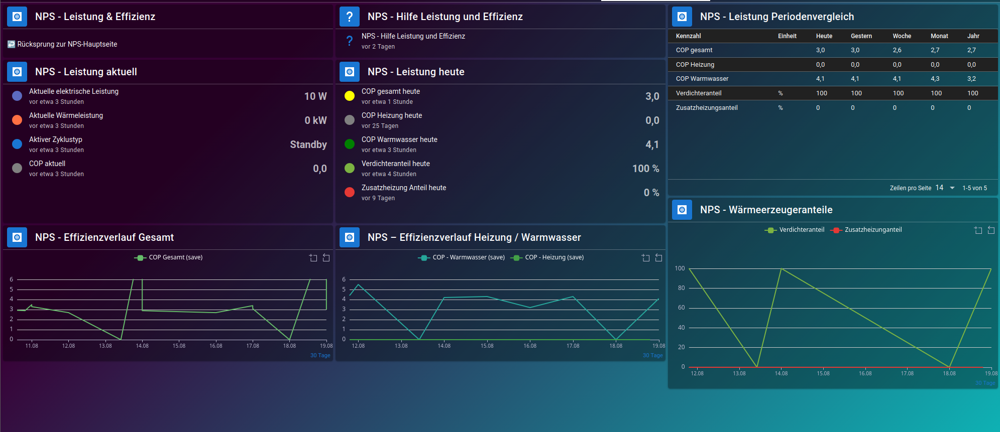
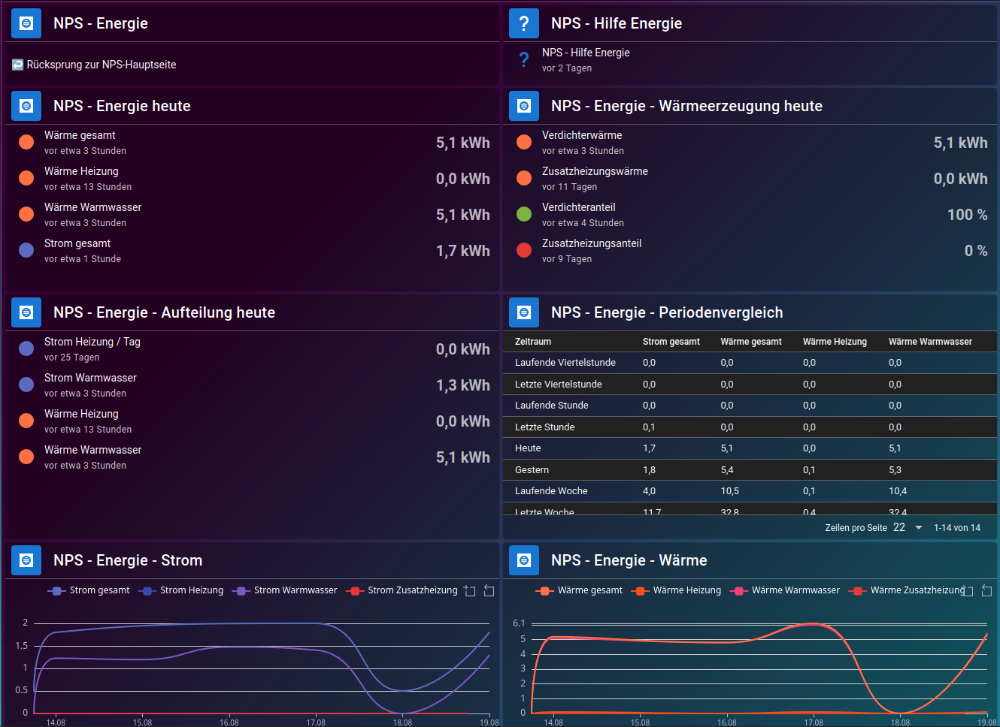
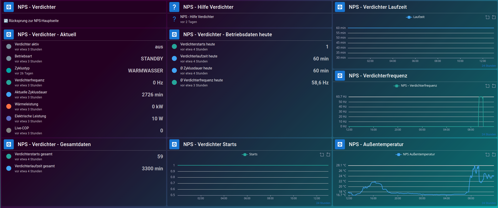
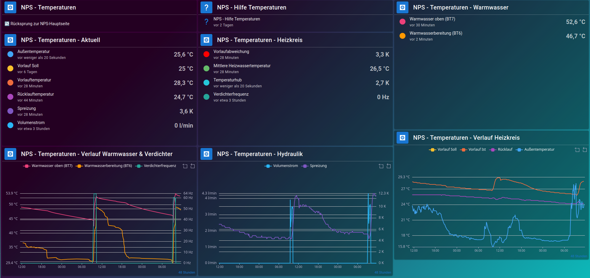
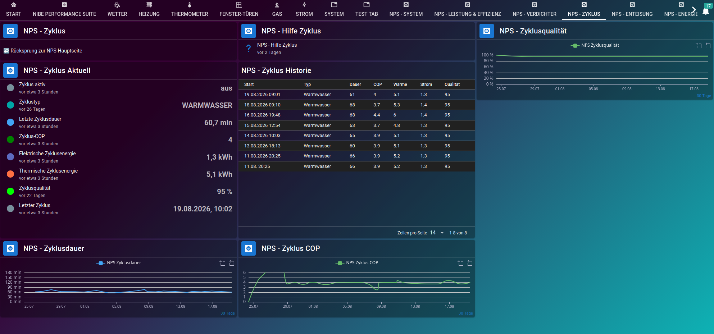
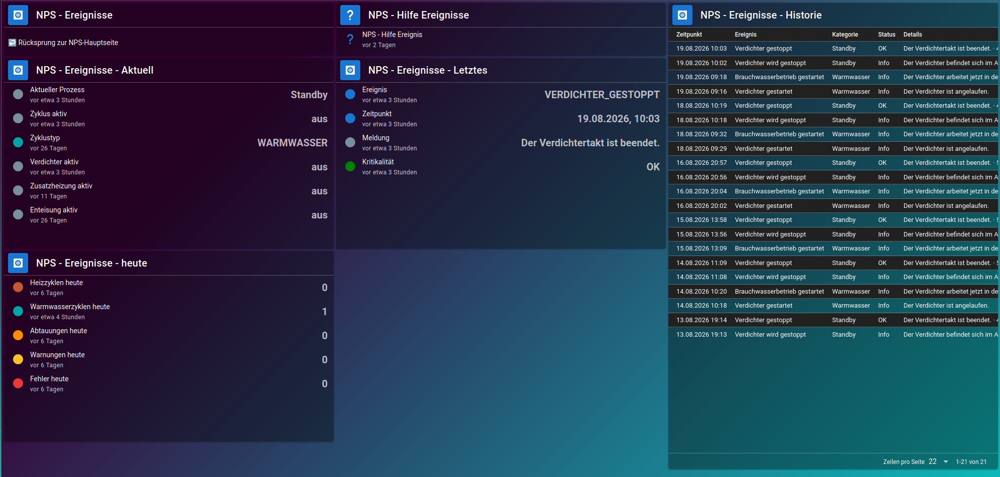
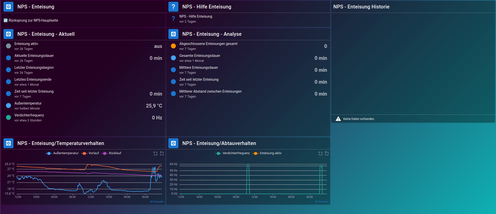
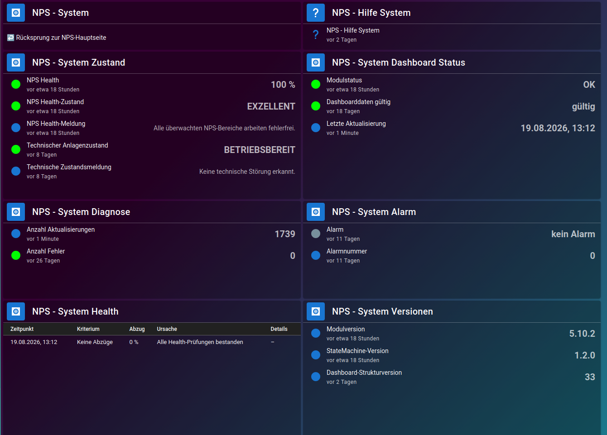

# Jarvis UI Reference

This page documents the visual **NPS V1.0.0 Jarvis reference state**.

The screenshots are visual documentation of the tested user interface. They are
not the technical source of truth for NPS. The scripts, public data points,
Jarvis configuration and NPS documentation remain authoritative.

## 1. Overview

The NPS main page provides the compact operational overview: system health,
performance and efficiency, energy, compressor, temperatures, cycle status,
events and defrost status.

## 2. Performance & Efficiency

Current electrical and thermal power, current COP, daily efficiency values,
period comparison, efficiency history and heat-generator shares.

## 3. Energy

Daily energy balance, heating and domestic-hot-water allocation, compressor and
auxiliary-heater heat generation, period comparison and historical energy
graphs.

## 4. Compressor

Current compressor state, operating mode, cycle type, frequency, power and COP,
together with daily/total operating data and history graphs.

## 5. Temperatures

Current heating-circuit temperatures, flow deviation, hydraulics, domestic hot
water (BT7/BT6), compressor frequency and temperature history.

## 6. Cycles

Current/last cycle values, cycle history, cycle duration, COP and quality
history.

## 7. Events

Current process and operating states, latest event, daily event counters and
event history.

## 8. Defrost

Current defrost state, defrost analysis, defrost history and temperature /
compressor behavior.

## 9. System & Health

NPS health state, technical plant state, dashboard validity, diagnostics,
alarm information, health deductions and NPS version information.

## Version note

Screenshots captured on **2026-08-19** with **Jarvis 3.1.8** as part of the
NPS V1.0.0 reference environment.

Displayed operating values are examples from the capture time and are not
fixed expected values.
